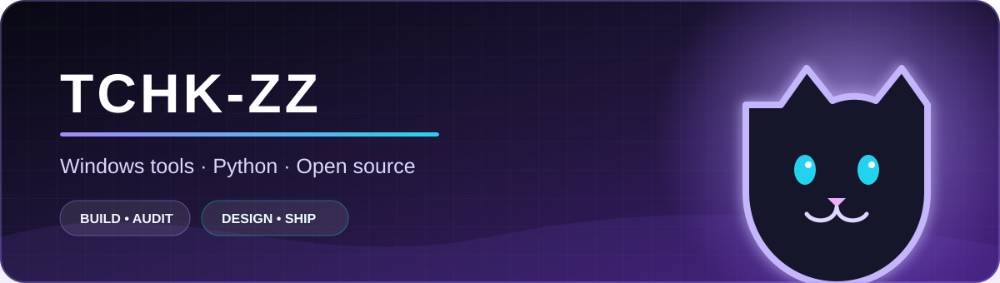

### Привет! Здесь собраны мои публичные проекты и эксперименты.

## ✦ Главный проект

<table>
<tr>
<td width="66%">

### [Zapret GUI](https://github.com/Tchk-zz/cat-zapret)

Современный Windows-интерфейс для Zapret: стратегии, автоподбор, диагностика,
безопасная полная синхронизация upstream-файлов и встроенный Telegram proxy.

</td>
<td width="34%" align="center">

**Windows 10 / 11**  
Python · PyQt6 · WinDivert  
GitHub Actions · Inno Setup

</td>
</tr>
</table>

## ✦ Репозитории

## ✦ Технологии

## ✦ Подход

- понятный интерфейс вместо ручной рутины;
- обновления с проверкой, staging и rollback;
- regression-тесты для найденных production-багов;
- аккуратная документация и воспроизводимые релизы.

